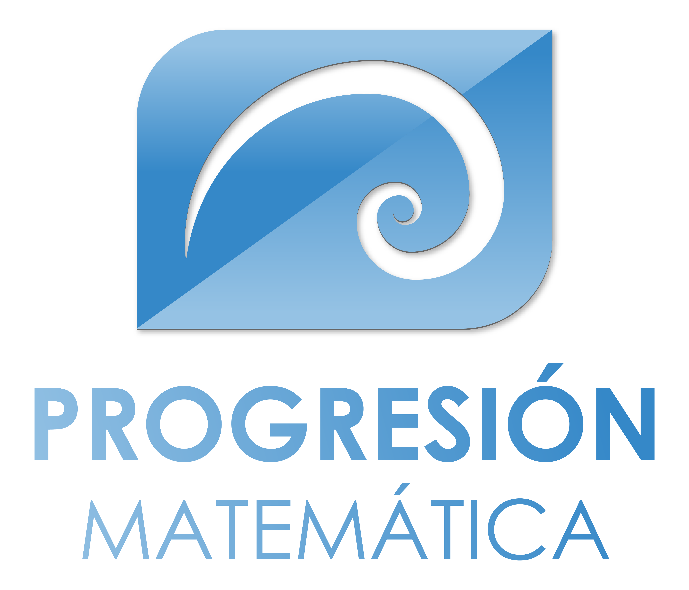

  
# *Introduction* 
Mathematical Progression is an exciting project that aims to revolutionize the way children from 12 to 16 years old learn mathematics. Through an interactive and user-friendly web platform, combining cutting-edge technologies such as React and PHP, we are creating an educational experience that is engaging, effective and, most importantly, fun. Join us on this journey to transform math learning into an exciting adventure for young learners.

# *Description of the project* 
The "Progresión Matemática" website is an interactive and user-friendly platform that offers educational content, games and activities for learning mathematics and logical-mathematical thinking. Children will be able to explore different mathematical topics adapted to their age level, access clear explanations and perform practical exercises. 
In terms of its features are:
- Sections differentiated by age levels to adapt the content to the specific needs of each group.
- Educational content structured in topics for each level.
- Clear and concise explanations of the concepts, using language accessible to children in downloadable pdf format and images.
- Intuitive and attractive interface, with a colorful and child-friendly design.
- Compatible with different devices.

# *Functionalities* 
"Progresión Matemática" is designed to offer an interactive and effective learning experience. Some of the key functionalities you will find in our platform include:
 - **Structured Educational Content:** We offer a wide range of mathematical topics structured at different levels of difficulty, allowing students to choose according to their knowledge and skills.
 - **Clear and Concise Explanations:** Each mathematical concept is presented in a clear and accessible way, with explanations in downloadable format (PDF) and images that facilitate understanding.
 - **Age-Differentiated Sections:** We adapt the content to different age groups, ensuring that the challenges and exercises are appropriate for children based on their developmental level.
 - **Intuitive and Attractive Interface:** Our platform has a colorful and friendly design that attracts children's attention and makes navigation easy.
 - **Responsive Design:** Progresión Matemática is compatible with a variety of devices and screen sizes, allowing users to access the content from desktop computers, tablets and mobile devices.
 - **Integrated Database:** We use a MySQL database to store and manage the educational resources available on the platform, making it easy to organize and update content. 
These functionalities work together to provide children with a unique and stimulating mathematical learning experience.

# *How users can use it* 
In order to visualize the frontend part of this project properly you need react and axios installed. 
First of all please clone the repository:
 - https://github.com/Sara-Poyo-Pastor/PROGRESION_MATEMATICA.git    

You can run the project with:
  
        npm start
Run the following command to install all the required dependencies for the project:

        npm install
To start the development server, use the following command:
        
        npm run dev
To display it in the browser, open your local host:
  
        http://localhost:5173

The page will automatically reload if you make changes to the code. 
You will see the build errors and lint warnings in the console. 

--------------------------------------------------------------
In order to visualize the backend part of this project properly you need PHP and laravel installed. 
First of all please clone the repository:
 - https://github.com/Sara-Poyo-Pastor/ProMat.git  

Run the following command to install all the required dependencies for the project:

        composer install
To start the Laravel development server, use:

        php artisan serve
The backend will be accessible at http://127.0.0.1:8000 (or your localhost).

# *Learn more about React*  
You can find detailed instructions on using Create React App and many tips in [its documentation](https://create-react-app.dev/). 

# *Learn more about Laravel*  
Laravel is a web application framework with expressive, elegant syntax. We believe development must be an enjoyable and creative experience to be truly fulfilling. Laravel takes the pain out of development by easing common tasks used in many web projects, such as:

- [Simple, fast routing engine](https://laravel.com/docs/routing).
- [Powerful dependency injection container](https://laravel.com/docs/container).
- Multiple back-ends for [session](https://laravel.com/docs/session) and [cache](https://laravel.com/docs/cache) storage.
- Expressive, intuitive [database ORM](https://laravel.com/docs/eloquent).
- Database agnostic [schema migrations](https://laravel.com/docs/migrations).
- [Robust background job processing](https://laravel.com/docs/queues).
- [Real-time event broadcasting](https://laravel.com/docs/broadcasting).

Laravel is accessible, powerful, and provides tools required for large, robust applications.
Laravel has the most extensive and thorough documentation and video tutorial library of all modern web application frameworks, making it a breeze to get started with the framework.

You may also try the Laravel Bootcamp, where you will be guided through building a modern Laravel application from scratch.

If you don't feel like reading, Laracasts can help. Laracasts contains over 2000 video tutorials on a range of topics including Laravel, modern PHP, unit testing, and JavaScript. Boost your skills by digging into our comprehensive video library. 

# *Technologies used*  

       

 
